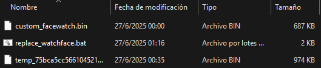

# ⌚ FitCloudPro Watchface Uploader Helper

This is a simple Windows `.bat` script that helps automate the process of replacing the temporary watchface file generated by **FitCloudPro** when uploading custom `.bin` watchfaces.

Instead of manually renaming files and navigating folders, this tool takes care of renaming and replacing the temporary file for you.

---

## 🚀 Purpose

FitCloudPro-compatible watches allow uploading custom watchfaces, but the app generates a temporary file with a random name (e.g., `temp_xxxxxxx.bin`) that must be manually replaced with your own `.bin` file.

This script streamlines that process by:
- Automatically detecting the temporary `temp_*.bin` file.
- Replacing its contents with your custom `.bin` watchface.
- Keeping the original filename so that FitCloudPro will still recognize it.

---

## 🛠 How to Use

You can follow the steps below either **directly on your phone**, or **entirely from your PC** by connecting your phone via USB and browsing the internal storage.

---

### 📱 Option 1: Using Your Phone + File Manager

1. **Open the FitCloudPro app** on your phone.
2. Go to the **Dial Market** and select the **first customizable watchface**.
3. Tap **Create**, but **do not tap Push**.
4. Without closing the app, switch to your phone’s file manager.
5. Navigate to:
   ```
   Android/data/com.topstep.fitcloudpro/files/download/
   ```
6. Copy the file that starts with `temp_` (e.g., `temp_98374.bin`) to your PC.
7. Place the following files in the same folder as this script:
   - The copied `temp_*.bin` file
   - Your custom `.bin` watchface file (with any name)
8. **Run the script** (`replace_watchface.bat`):
   - It will detect both `.bin` files
   - Replace the contents of `temp_*.bin` with your custom file
   - Preserve the original filename
9. Go back to the **FitCloudPro app** and now tap **Push**.

✅ Your custom watchface should now upload and install!

---

### 💻 Option 2: Using Only Your PC (Recommended)

1. Connect your phone to your PC via USB.
2. On your phone, allow **file transfer (MTP)** when prompted.
3. On your PC, navigate to the following path in your phone’s storage:
   ```
   This PC > [Your Phone Name] > Android > data > com.topstep.fitcloudpro > files > download
   ```
4. Copy the file that starts with `temp_` (e.g., `temp_98374.bin`) to the folder containing this script.
5. Also place your custom `.bin` watchface file (with any name) in the same folder.
6. Run the script (`replace_watchface.bat`).
7. The script will:
   - Detect and verify the required `.bin` files
   - Replace the `temp_*.bin` content with your custom file
   - Preserve the original name so FitCloudPro accepts it
8. Copy the modified `temp_*.bin` file **back to the same `download` folder** on your phone, replacing the original.
9. Return to the **FitCloudPro app** and now tap **Push**.

✅ Your custom watchface should now upload and install!

---

## 📂 Folder Example

/FitCloudUploader/<br>
│<br>
├── temp_75bca5cc566104521...bin ← From FitCloudPro<br>
├── mywatchface.bin ← Your custom face<br>
├── replace_watchface.bat ← This script




---

## ⚠️ Notes

- The folder **must contain exactly 2 `.bin` files**:
  - One starting with `temp_`
  - One being your custom `.bin` watchface
- If not, the script will show a clear error message.
- UTF-8 encoding is handled automatically for proper character display.

---

## 📌 License

This project is provided under the [MIT License](LICENSE).

---

## 🙌 Credits

Developed for FitCloudPro users who want a faster way to upload their custom watchfaces without the hassle of manual renaming.

Enjoy your personalized watch!

